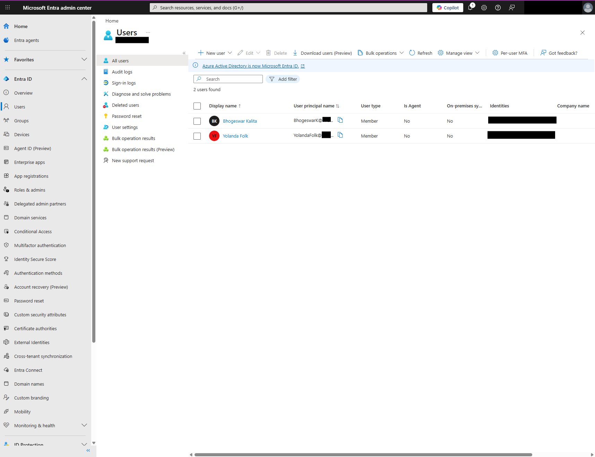
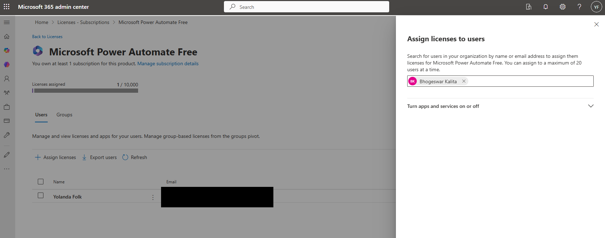
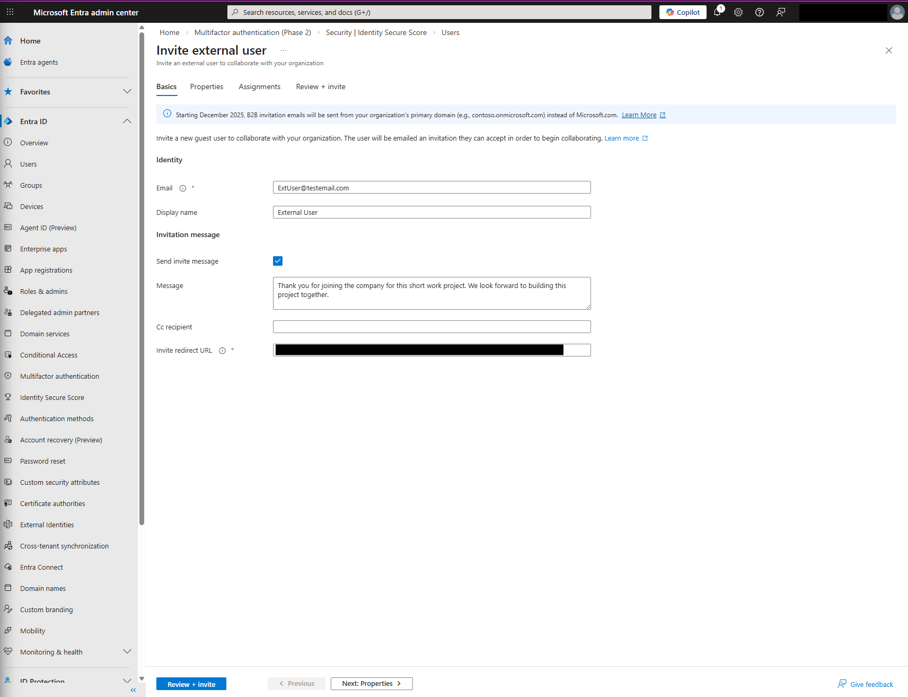
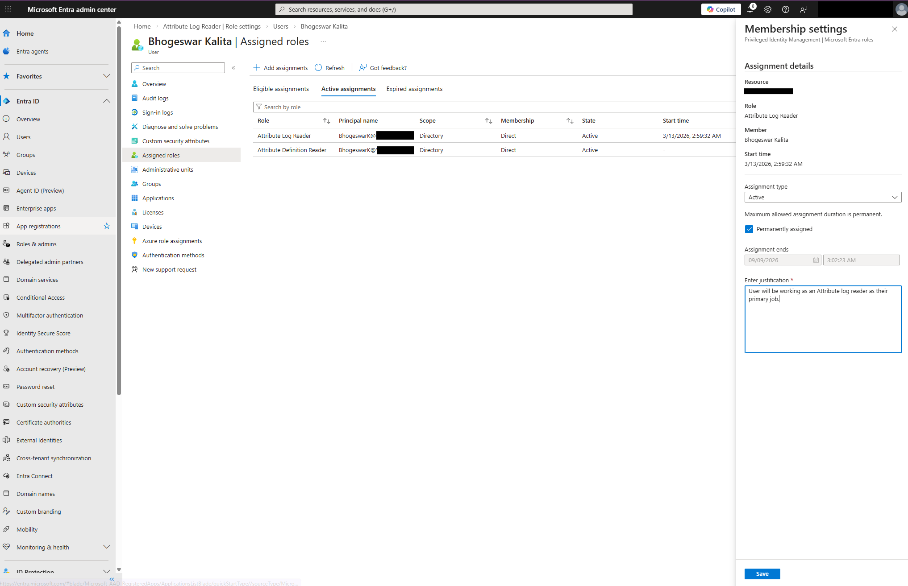
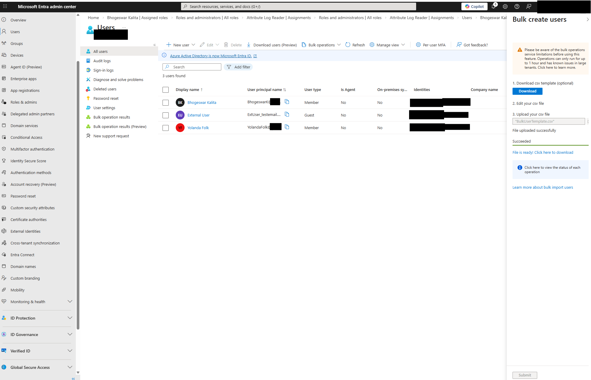

Project Overview:
In this lab, I managed the end-to-end identity lifecycle for a cloud-native environment. I performed critical administrative tasks in Microsoft Entra ID, focusing on secure user provisioning, external collaboration, and Role-Based Access Control (RBAC).
•	Tools Used: Microsoft Entra Admin Center, Microsoft 365 Admin Center, CSV Automation.
•	Key Focus: Network Security & Information Assurance.
Technical Execution
1. User Provisioning & Validation
•	Task: Manually provisioned a new cloud identity (Bhogeswar Kalita).
•	Process: Configured core attributes including UPN, display name, and usage location.
•	Validation: Verified account functionality by performing a successful sign-in via an InPrivate browser session and completing initial MFA setup.
2. License & Resource Allocation
•	Task: Assigned productive resources to users.
•	Process: Utilized the Microsoft 365 Admin Center to allocate a Microsoft Power Automate Free license, ensuring the user had immediate access to required enterprise tools.
3. B2B External Collaboration
•	Task: Invited an external guest user to the tenant.
•	Process: Oversaw the guest invitation process (ExtUser@testemail.com), including a custom professional invitation message to facilitate secure cross-tenant project collaboration.
4. Role-Based Access Control (RBAC) Implementation
•	Task: Assigned administrative permissions using the Principle of Least Privilege (PoLP).
•	Implementation:
o	Eligible Assignment: Assigned the Attribute Definition Reader role as "Eligible" to support Just-In-Time (JIT) access concepts.
o	Active Assignment: Assigned the Attribute Log Reader role with a mandatory business justification for audit compliance.
5. Bulk Identity Automation
•	Task: Scaled user creation through automated import.
•	Process: Oversaw the bulk creation of users by modifying a standardized .csv template, validating domain parameters, and submitting the batch for processing.

Security Analysis & Best Practices
•	Least Privilege: By assigning specific "Reader" roles rather than broad "Administrator" access, I reduced the potential attack surface of the tenant.
•	Audit Trails: The use of Justifications during role assignment ensures that every administrative action is documented for future security audits.
•	Operational Security: During documentation, all sensitive Tenant IDs and Admin Credentials were redacted to maintain environment integrity.

Evidence of Completion
[!NOTE] All sensitive information (Tenant IDs, Personal Emails) has been redacted to maintain Operational Security.
### User Creation Success

### License Assignment

### External Guest Invitation

### RBAC & Role Justification

### Bulk Import Success

Learning Credits
This lab is based on the Microsoft Learn module: Perform basic User Management tasks in Microsoft Entra ID.
